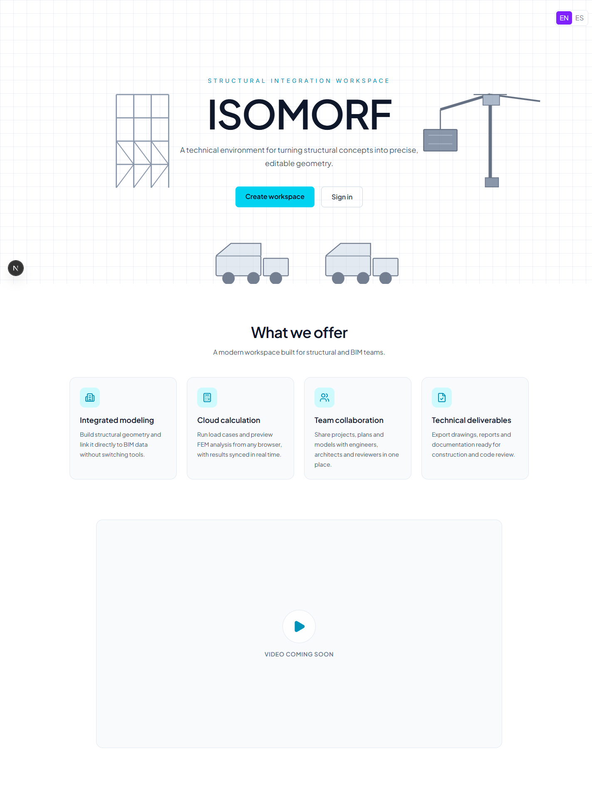
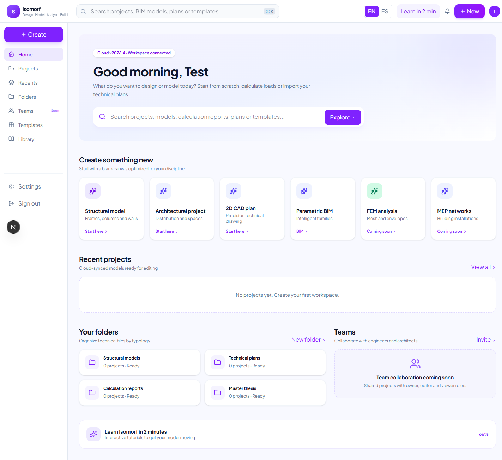
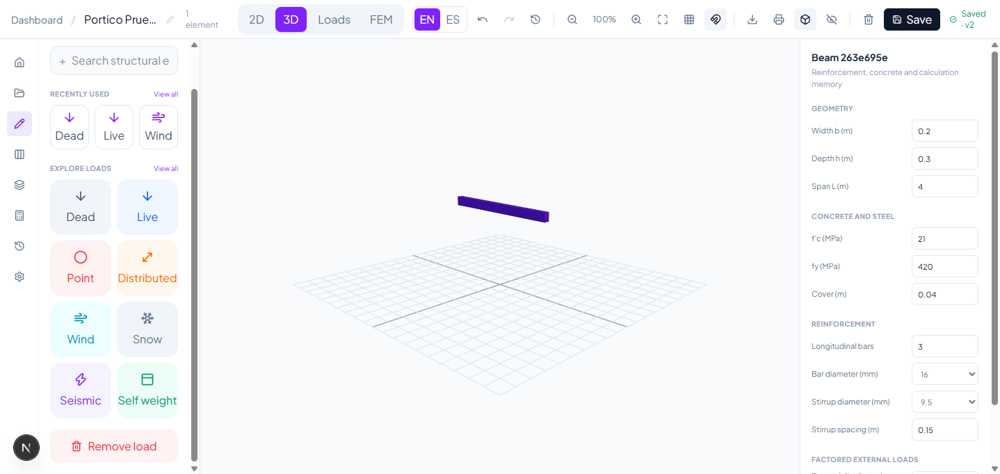
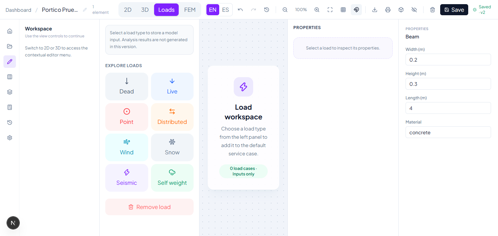
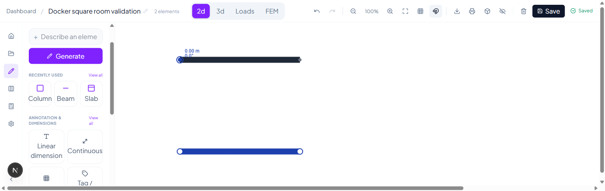

<div align="center">

# ISOMORF

**A structural design workspace for the web — CAD-grade 2D plan editing, live 3D preview and server-versioned documents.**

[](https://github.com/TefaSalcedo/isomorf-frontend/actions/workflows/ci.yml)
[](https://nextjs.org)
[](https://react.dev)
[](https://www.typescriptlang.org)
[](https://choosealicense.com/no-permission/)



</div>

## What is ISOMORF?

ISOMORF (*Structural Integration Workspace*) is a technical environment for turning structural concepts into precise, editable geometry — think AutoCAD + SAP2000 in the browser. Draw a floor plan with CAD-grade precision, inspect the model in 3D, attach loads and member designs, and rely on a server-versioned document where undo/redo survives a reload.

This repository is the web frontend. The API lives at **[TefaSalcedo/isomorf-backend](https://github.com/TefaSalcedo/isomorf-backend)**.

## Features

### 2D plan editor (Konva canvas)

- **21 element types** — structural members (walls, columns, beams, slabs, footings, stairs…) plus 7 CAD annotation primitives: `line`, `polyline`, `arc`, `circle`, `ellipse`, `rectangle`, `hatch`
- **Typed numeric input**, AutoCAD style: `x,y` absolute · `@dx,dy` relative · `L<deg` polar · `WxH` rectangle size · `c` closes a polyline — a 6×4 m plan can be drawn keyboard-only
- **Snapping with priority tiers**: endpoint, midpoint, center, intersection, perpendicular, nearest, quadrant and polyline vertices
- **Command palette** (`Ctrl+K`) with deterministic aliases in English and Spanish, polar tracking and dynamic input next to the cursor
- Grid, snap, zoom/pan, fit and clean mode

### Engineering workflow

- **Live 3D model preview** (React Three Fiber) — annotation primitives stay in 2D, structural members extrude into 3D
- **Member design inspector** with local calculation memory (D/C, Mu/φMn, Vu/φVn), exportable to Markdown
- **Structural loads panel**: dead, live, wind, point, distributed, snow, seismic and self-weight cases
- **Element table** for bulk inspection and editing, plus a layer manager

### Platform

- **Server-versioned documents** — atomic saves, persisted undo/redo/restore across reloads and a revision history panel ([design doc](docs/versioned-document-model.md))
- **Teams & roles** — shared projects with owner / editor / viewer; viewers get a locked read-only editor
- **Bilingual UI** (English / Spanish) via `next-intl`, persisted per user
- **Responsive** down to phone width (390 px) with compact toolbars and property sheets; axe-checked core flows

## Screenshots

| Dashboard | 3D preview + member design | Loads workspace |
| --- | --- | --- |
|  |  |  |



## Tech stack

| Area | Choice |
| --- | --- |
| Framework | Next.js 16 (App Router, standalone output) |
| UI | React 19, Tailwind CSS 4 |
| 2D canvas | Konva / react-konva |
| 3D | Three.js, @react-three/fiber, @react-three/drei |
| i18n | next-intl |
| Unit tests | Vitest + Testing Library |
| E2E | Playwright (against the real backend) |
| Package manager | pnpm |

## Getting started

Prerequisites: **Node.js 22+**, **pnpm 11**, and the [ISOMORF API](https://github.com/TefaSalcedo/isomorf-backend) listening on `NEXT_PUBLIC_API_URL` (default `http://localhost:8000`).

```bash
pnpm install
NEXT_PUBLIC_API_URL=http://localhost:8000 pnpm dev
```

Open <http://localhost:3000>.

### Scripts

| Command | What it does |
| --- | --- |
| `pnpm dev` | Next.js dev server |
| `pnpm build` / `pnpm start` | Production build / start |
| `pnpm lint` / `pnpm typecheck` | ESLint / `tsc --noEmit` |
| `pnpm test` | Vitest unit + component tests |
| `pnpm test:e2e` | Playwright end-to-end suite |

## Testing

Unit and component tests run on Vitest. The Playwright suite exercises the **real stack** — it registers disposable users, draws through the UI and reloads to verify server persistence — so the backend must be running on `NEXT_PUBLIC_API_URL` before `pnpm test:e2e`.

CI ([`.github/workflows/ci.yml`](.github/workflows/ci.yml)) runs lint, typecheck, unit tests and build on every PR, plus the full e2e suite against a Postgres service and the backend repo.

## Roadmap

The product plan — 24 weeks across CAD tooling, collaboration, parametric elements, structural analysis (NSR-10) and deliverables — lives in [`docs/ROADMAP.md`](docs/ROADMAP.md).

## License

All rights reserved. This repository is public for portfolio and review purposes — reuse, redistribution or commercial use of the code requires written permission from the author.
